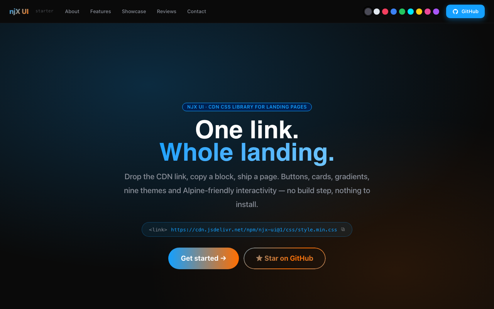

# astro-njx-saas

**Product landing starter — Astro + [njX UI](https://njxui.dev) (npm: `njx-ui`) + Alpine.js.**

One CSS import, nine runtime themes, ~30 lines of custom chrome. Every element on
the page is an njX UI class; interactivity is plain Alpine `x-data` right in the
markup; Astro renders it all to static HTML.

**Live demo:** https://astro-njx-saas.pages.dev



## What you get

- **Full-viewport hero** with a signature glow, a click-to-copy announcement pill and gradient CTAs
- **Sticky glass navbar** — gradient logo, anchor links, 9-theme dot switcher, burger menu on mobile
- **About** with metric cards, **Features** on three showcase card styles (`card-aura` / `card-shine` / `card-outline-gradient`)
- **Showcase** — checklist + mini-card grid on a soft glow backdrop
- **Reviews slider** — autoplay, progress bar, prev/next, dots, touch swipe (library `.hero-slider` + one Alpine object)
- **Contact form** in a gradient shell with a success toast
- **Social pills**, footer, and a configurable once-per-visitor "star us" modal

## The stack

| Layer | Tool | Why |
| ----- | ---- | --- |
| Markup & build | [Astro](https://astro.build) | Components, zero JS by default |
| Look | [njX UI](https://njxui.dev) — 44 KB gzip | Ready blocks: cards, gradients, sliders, modals |
| Interactivity | [Alpine.js](https://alpinejs.dev) | Theme switch, slider, form — state lives in the markup |

No Tailwind, no design tokens to configure — `import 'njx-ui/css/style.min.css'`
and you're styling.

## Quick start

```bash
git clone https://github.com/njbSaab/astro-njx-saas my-landing
cd my-landing
npm install
npm run dev
```

Open `http://localhost:4321`, then make it yours:

1. **`src/config.ts`** — name, links, the hero pill snippet, star-popup delay (0 disables it).
2. **Data arrays** in `src/components/{About,Features,Showcase,Reviews}.astro` — metrics, cards, checklist, slides.
3. **Copy** — headings and paragraphs live right in the section components.

## What's inside

```
src/
├── config.ts                 # brand, links, popup — rebrand in one file
├── layouts/Layout.astro      # njX UI import · theme restore · page-wide Alpine state
├── styles/global.css         # site chrome: navbar, hero sizing, form shell (~380 lines)
├── components/
│   ├── Nav.astro             # sticky header + mobile burger menu
│   ├── Hero.astro            # 100dvh hero + copyable CDN pill
│   ├── About.astro           # metric cards (data-driven)
│   ├── Features.astro        # three showcase card styles (data-driven)
│   ├── Showcase.astro        # checklist + mini-card grid (data-driven)
│   ├── Reviews.astro         # hero-slider: autoplay · progress · dots · swipe
│   ├── Contact.astro         # gradient form shell + success toast
│   ├── Social.astro          # social-list-pills
│   ├── StarModal.astro       # once-per-visitor modal (lib-modal-*)
│   └── Footer.astro
└── pages/index.astro         # assembles the sections
```

## Themes

njX UI ships 9 themes driven by one attribute:

```html
<html data-theme="dark">   <!-- dark · light · red · blue · green · cyan · yellow · pink · purple -->
```

The navbar dots persist the choice to `localStorage`; the layout restores it
before first paint (no flash).

## Deploy

[](https://dash.cloudflare.com/?to=/:account/pages/new)
[](https://app.netlify.com/start/deploy?repository=https://github.com/njbSaab/astro-njx-saas)

Static output — any host works. Build command `npm run build`, output directory `dist`.

## Learn more

- njX UI documentation: https://njxui.dev/documentation (Astro 🚀 and Alpine 🏔 modes)
- Alpine presets for njX components: https://njxui.dev/documentation#njx-alpine
- More ready-made landings: https://njxui.dev/examples
- Classless sibling library: https://classless.njxui.dev

## License

MIT — use it for anything, no attribution required.
